# Kabanero Developer Experience - Getting Started

Kabanero is an open source project focused on bringing together key foundational open source technologies into a framework for developing and deploying modern cloud-native applications.  The Kabanero developer experience leverages the Appsody and Eclipse Codewind open source projects enabling developers to use project 'templates' to rapidly create new cloud-native applications, develop and build them in a curated container 'stack' environment and deploy them to Knative/Kubernetes all without the need for container or Kubernetes skills.

This tutorial will give you an introduction to the Kabanero developer experience. You'll create and deploy a Java MicroProfile based cloud-native application, however, Kabanero provides a number of stacks, including Node.js and Spring Boot and is extensible so others can easily be added. For more information, see [Appsody.dev](https://appsody.dev/).

At the end of this tutorial, you should have a good understanding of the Kabanero developer experience through the use of Appsody and Eclipse Codewind.  You'll know how to create a new application, develop and deploy it to Knative and have an appreciation for how Kabanero does all the heavy-lifting helping you focus on the task of writing the code.


## Table of Contents
- [Kabanero Developer Experience - Getting Started](#kabanero-developer-experience---getting-started)
  - [Table of Contents](#table-of-contents)
  - [Before You Begin](#before-you-begin)
    - [Pre-requisites](#pre-requisites)
    - [Enable Kubernetes](#enable-kubernetes)
    - [Visual Studio Code Kabanero Setup](#visual-studio-code-kabanero-setup)
      - [Installing the Codewind Extension for Visual Studio Code](#installing-the-codewind-extension-for-visual-studio-code)
    - [Installing the Appsody CLI](#installing-the-appsody-cli)
      - [Sharing the Appsody Configuration between the CLI and Visual Studio Code - Optional](#sharing-the-appsody-configuration-between-the-cli-and-visual-studio-code---optional)
    - [Pre-requisite checks and caching of large images](#pre-requisite-checks-and-caching-of-large-images)
  - [Developing Cloud-native applications - Appsody](#developing-cloud-native-applications---appsody)
    - [Getting to know Appsody](#getting-to-know-appsody)
    - [Creating a new Project with Appsody](#creating-a-new-project-with-appsody)
    - [Live coding with Appsody](#live-coding-with-appsody)
    - [Deploying to Kubernetes](#deploying-to-kubernetes)
  - [Developing Cloud-native applications - Codewind](#developing-cloud-native-applications---codewind)
    - [Using a Custom Appsody Stack from Codewind](#using-a-custom-appsody-stack-from-codewind)
    - [Creating a new Codewind Project](#creating-a-new-codewind-project)
    - [Looking Inside the Container](#looking-inside-the-container)
    - [Viewing Application Metrics](#viewing-application-metrics)
    - [Running Load Tests](#running-load-tests)
- [Start postgresql](#start-postgresql)
      - [Further reading: Development versus production behaviour](#further-reading-development-versus-production-behaviour)

## Before You Begin
Before you get started, there are a number of pre-reqs you'll need to install.  These are the pre-reqs for developing a Java MicroProfile application using Kabanero.  Different pre-reqs will be required for other application stacks.

### Pre-requisites

For **Windows users** only: 
* Due to the Docker Desktop dependency mentioned below, this workshop requires Windows users to have either a Windows 10 Pro or Windows 10 Enterprise installation
* Whereas the developer experience for Kabanero supports Windows users, this workshop also covers the experience for Kabanero architects, which depends on a Linux shell environment. The instructions for this workshop have been tested with [Cygwin](https://www.cygwin.com/).
* Ensure your Cygwin home directory matches your Windows home directory, as described in [this blog entry](https://ryanharrison.co.uk/2015/12/01/cygwin-change-home-directory.html).
* The workshop content has not been validated against the [Windows Subsystem for Linux (WSL)](https://docs.microsoft.com/en-us/windows/wsl) . The Docker CLI running inside WSL requires special settings to communicate with Docker Desktop running on Windows, and that configuration is outside the scope of the validated instructions.

For all users, you need to install the following pre-requisites to complete this tutorial:

* [A Java 8 JDK Installation](https://adoptopenjdk.net/?variant=openjdk8&jvmVariant=openj9)
* [Apache Maven](https://maven.apache.org/)
* Docker Desktop
  * [Windows Docker Installation](https://docs.docker.com/docker-for-windows/)
  * [MacOS Docker Installation](https://docs.docker.com/docker-for-mac/)
* [Visual Studio Code](https://code.visualstudio.com/)

### Enable Kubernetes

You will need to enable Kubernetes as this is disabled by default in Docker Desktop. This can be done by going to **Preferences**, navigating to the **Kubernetes** tab, and checking **Enable Kubernetes**.

### Visual Studio Code Kabanero Setup

#### Installing the Codewind Extension for Visual Studio Code
Eclipse Codewind provides a set of extensions to IDEs for doing cloud-native application development.  They enable a full developer/debug cycle with an incremental build where all the code is built and run inside a container.  This means that the likelihood of issues due to different development, build and production environments is vastly reduced.

Although Codewind is an Eclipse project, it's not limited to the Eclipse IDE and in this tutorial, you will use Codewind inside Visual Studio Code.

Codewind requires Docker, so before you begin, ensure your Docker install is complete and running.

To install the **Codewind Extension** for **Visual Studio Code**, you have two options.

1. Install using the **Install** button on [this page](https://marketplace.visualstudio.com/items?itemName=IBM.codewind).

2. Manually launch Visual Studio Code, navigate to the **Extensions** view, search for **Codewind**, and install the extension from here.

### Installing the Appsody CLI
Depending on your operating system, the installation process for the **Appsody CLI** will differ. To correctly install **Appsody** for your operating system, view the following [link](https://appsody.dev/docs/getting-started/installation).

Verify that the CLI tool is installed correctly by executing the following into your terminal:

```
$ appsody
```

#### Sharing the Appsody Configuration between the CLI and Visual Studio Code - Optional
While this is optional, it is recommended. Rather than having **Appsody CLI** projects stored separately to those you may create in an editor such as **Visual Studio Code** or **Eclipse**, updating the **Appsody** configuration file will enable you to work on your projects across both the CLI and editor.

To share the Appsody configuration, follow the instructions at [this repository](https://github.com/kabanero-io/appsodyExtension#optional-using-the-same-appsody-configuration-between-local-cli-and-codewind).

### Pre-requisite checks and caching of large images

This step will ensure your environment has all the prerequisites installed and running.

In addition to checking prerequisites, this step will also cache large images into your local system. The cached content will save you valuable time at the beginning of the workshop.

Linux Users:
```
curl -sL https://github.com/gcharters/kabanero-dev-getting-started/releases/download/0.0.1/workshop-setup.sh | bash
```

Windows Users on a Cygwin shell:
```
curl -sL https://github.com/gcharters/kabanero-dev-getting-started/releases/download/0.0.2/workshop-setup.sh | bash
```


## Developing Cloud-native applications - Appsody

### Getting to know Appsody

We're going to start by trying out the developer experience Appsody provides and then we'll move on to use Eclipse Codewind.

Let's take a look at what Appsody provides in terms of capabilities.  In a command prompt, type:

```
appsody
```

You should see output similar to the following:

```
charters@Grahams-MBP-2 ~ $ appsody
The Appsody command-line tool (CLI) enables the rapid development of cloud native applications.

Complete documentation is available at https://appsody.dev

Usage:
  appsody [command]

Available Commands:
  build       Locally build a docker image of your appsody project
  completion  Generates bash tab completions
  debug       Run the local Appsody environment in debug mode
  deploy      Build and deploy your Appsody project to your Kubernetes cluster
  extract     Extract the stack and your Appsody project to a local directory
  help        Help about any command
  init        Initialize an Appsody project with a stack and template app
  list        List the Appsody stacks available to init
  operator    Install or uninstall the Appsody operator from your Kubernetes cluster.
  repo        Manage your Appsody repositories
  run         Run the local Appsody environment for your project
  stop        Stops the local Appsody docker container for your project
  test        Test your project in the local Appsody environment
  version     Show Appsody CLI version

Flags:
      --config string   config file (default is $HOME/.appsody/.appsody.yaml)
      --dryrun          Turns on dry run mode
  -h, --help            help for appsody
  -v, --verbose         Turns on debug output and logging to a file in $HOME/.appsody/logs

Use "appsody [command] --help" for more information about a command.
```

The Appsody CLI has a number of **Commands**.  The majority of these commands are for working  with stacks: build, debug, run stop, test, and extract, list.

Let's take a look at what stacks we have available by entering:

```
appsody list
```

This command lists the available stacks and you should see something like:

```
charters@Grahams-MBP-2 ~ $ appsody list

REPO                 	ID                        	VERSION  	TEMPLATES	DESCRIPTION                                              
appsodyhub           	java-microprofile         	0.2.11   	*default 	Eclipse MicroProfile using OpenJ9 and Maven              
appsodyhub           	java-spring-boot2         	0.3.8    	*default 	Spring Boot using OpenJ9 and Maven                       
appsodyhub           	nodejs                    	0.2.5    	*simple  	Runtime for Node.js applications                         
appsodyhub           	nodejs-express            	0.2.5    	*simple  	Express web framework for Node.js                        
appsodyhub           	nodejs-loopback           	0.1.3    	*scaffold	LoopBack API framework for Node.js                       
appsodyhub           	swift                     	0.1.4    	*simple  	Runtime for Swift applications
```

You'll see that with the stacks available, we can develop new cloud-native applications using Java, Node or Swift, with a number of different, popular frameworks.

These are the default stacks that Appsody provides.  We're going to use a custom stack and to do so we need to take a look at where the stacks come from.  This is where the concept of repositories comes in.  Type the following:

```
appsody repo list
```

You should see an output similar to this:

```
charters@Grahams-MBP-2 ~ $ appsody repo list

NAME                 	URL                                                                                    
*appsodyhub          	https://raw.githubusercontent.com/appsody/stacks/master/index.yaml                     
```

`Appsodyhub` is the location where the appsody project releases its stacks.  The `*` indicates that this is the default repository.

We're going to use a custom stack created for this workshop.  Anybody can write a stack or customize a stack for use by others. Maybe you want to add support for another language or framework, or perhaps your company has additional governance requirements that you want to add into an existing stack.  We'll go into more details on stack development later, but for now, let's add in the stack we'll use in this part of the workshop.

As part of the setup for the workshop, you cloned a github repository and built a project that contained the new stack. Let's go to the output of that build:

```
workshop_dir=$(echo ~)"/workspace/kabanero-workshop"
cd ${workshop_dir}/stacks/ci/assets
```

If you list the contents of that directory, you should see something like this:

```
charters@Grahams-MBP-2 assets (master) $ ls
experimental-index-local.yaml
experimental-index.yaml
experimental.java-microprofile-dev-mode.templates.default.tar.gz
experimental.java-microprofile-dev-mode.v0.2.10.templates.default.tar.gz
experimental.java-microprofile-dev-mode.v0.2.6.templates.default.tar.gz
experimental.java-spring-boot2-liberty.templates.default.tar.gz
experimental.nodejs-functions.templates.simple.tar.gz
experimental.nodejs-loopback.templates.scaffold.tar.gz
experimental.quarkus.templates.default.tar.gz
incubator-index-local.yaml
incubator-index.yaml
incubator.java-microprofile.templates.default.tar.gz
incubator.java-spring-boot2.templates.default.tar.gz
incubator.java-spring-boot2.templates.kotlin.tar.gz
incubator.nodejs-express.templates.simple.tar.gz
incubator.nodejs-express.templates.skaffold.tar.gz
incubator.nodejs.templates.simple.tar.gz
incubator.swift.templates.simple.tar.gz
stable-index-local.yaml
stable-index.yaml
```

This contains the stack packages (.tar.gz files) and local/remote repository files for the `stable`, `incubator` and `experimental` stacks.  The stack we want to use is in the `experimental` repository.

Let's add the local repository definition to the set of repositories that the Appsody CLI can use:

```
appsody repo add workshop file://${workshop_dir}/stacks/ci/assets/experimental-index-local.yaml
```

Check the repository has been added:

```
appsody repo list
```

You should see:

```
charters@Grahams-MBP-2 assets (master) $ appsody repo list

NAME       	URL                                                                                      
*appsodyhub	https://raw.githubusercontent.com/appsody/stacks/master/index.yaml                       
workshop   	file:///Users/charters/workspace/kabanero-workshop/stacks/ci/assets/experimental-index-local.yaml
```

Let's see what stacks we now have available:

```
appsody list
```

You should now see an entry for a stack called `java-microprofile-dev-mode` from the `workshop` repository.

```
charters@Grahams-MBP-2 ~ $ appsody list

REPO      	ID                        	VERSION  	TEMPLATES	DESCRIPTION                                              
appsodyhub	java-microprofile         	0.2.11   	*default 	Eclipse MicroProfile using OpenJ9 and Maven              
appsodyhub	java-spring-boot2         	0.3.8    	*default 	Spring Boot using OpenJ9 and Maven                       
appsodyhub	nodejs                    	0.2.5    	*simple  	Runtime for Node.js applications                         
appsodyhub	nodejs-express            	0.2.5    	*simple  	Express web framework for Node.js                        
appsodyhub	nodejs-loopback           	0.1.3    	*scaffold	LoopBack API framework for Node.js                       
appsodyhub	swift                     	0.1.4    	*simple  	Runtime for Swift applications                           
workshop  	java-microprofile-dev-mode	0.2.10   	*default 	Eclipse MicroProfile on Open Liberty & OpenJ9 using Maven
```

We're now ready to start creating applications using the new Appsody stack.  

### Creating a new Project with Appsody

Make a directory to contain your project:

```
mkdir -p ~/workspace/kabanero-workshop/java-example
cd ~/workspace/kabanero-workshop/java-example
```

Create the new project.  This project will using the Java MicroProfile APIs defined at Eclipse and will run on the open source Open Liberty runtime running on Eclipse Open J9.

```
appsody init workshop/java-microprofile-dev-mode
```

When the build completes, you should see something like:

```
...
[InitScript] [INFO] ------------------------------------------------------------------------
[InitScript] [INFO] BUILD SUCCESS
[InitScript] [INFO] ------------------------------------------------------------------------
[InitScript] [INFO] Total time: 0.800 s
[InitScript] [INFO] Finished at: 2019-09-02T15:52:41+01:00
[InitScript] [INFO] ------------------------------------------------------------------------
Successfully initialized Appsody project
```

Open up the project in VS Code.  

```
code .
```

Note, we're not using Codewind at this point.  If you prefer, you can use other IDEs. To experience the incremental update during development you will need an IDE that automatically compiles Java source files each time they are saved.  VS Code (with the Red Hat `Language Support for Java`), Eclipse and IntelliJ IDEA are all known to work.

Expand the project `src` and you should see a structure and code like this:


This is intentionally a 'bare-bones' project so as to avoid the need to delete unnecessary files.  It contains a JAX-RS Application class called `StarterApplication.java`, and Liberty server configuration, `server.xml`, and static html file, `index.html` and the project build file, `pom.xml`

### Live coding with Appsody

Let's start the new application ready to make some edits.  Enter the following command:

```
appsody run
```

The run command for this stack has been set up to ensure the compiled code is up to date and then launch the Open Liberty server with the application deploy in `dev mode`.  Dev mode is Open Liberty's support for hot application update during development.

After a while you should see output similar to the following: 

```
[Container] [INFO] [AUDIT   ] CWWKE0001I: The server defaultServer has been launched.
[Container] [INFO] [AUDIT   ] CWWKZ0058I: Monitoring dropins for applications.
[Container] [INFO] [AUDIT   ] CWWKS4104A: LTPA keys created in 2.186 seconds. LTPA key file: /project/user-app/target/liberty/wlp/usr/servers/defaultServer/resources/security/ltpa.keys
[Container] [INFO] [AUDIT   ] CWPKI0803A: SSL certificate created in 6.720 seconds. SSL key file: /project/user-app/target/liberty/wlp/usr/servers/defaultServer/resources/security/key.jks
[Container] [INFO] [AUDIT   ] CWWKT0016I: Web application available (default_host): http://499c2f47b921:9080/metrics/
[Container] [INFO] [AUDIT   ] CWWKT0016I: Web application available (default_host): http://499c2f47b921:9080/health/
[Container] [INFO] [AUDIT   ] CWWKT0016I: Web application available (default_host): http://499c2f47b921:9080/openapi/ui/
[Container] [INFO] [AUDIT   ] CWWKT0016I: Web application available (default_host): http://499c2f47b921:9080/ibm/api/
[Container] [INFO] [AUDIT   ] CWWKT0016I: Web application available (default_host): http://499c2f47b921:9080/jwt/
[Container] [INFO] [AUDIT   ] CWWKT0016I: Web application available (default_host): http://499c2f47b921:9080/openapi/
[Container] [INFO] [ERROR   ] CWWKO1650E: Validation of the OpenAPI document produced the following error(s): 
[Container] [INFO]                                                                                                                
[Container] [INFO]  - Message: Required "paths" field is missing or is set to an invalid value, Location: #
[Container] [INFO] 
[Container] [INFO] [AUDIT   ] CWWKT0016I: Web application available (default_host): http://499c2f47b921:9080/
[Container] [INFO] [AUDIT   ] CWWKZ0001I: Application starter-app started in 11.185 seconds.
[Container] [INFO] CWWKM2015I: Match number: 1 is [9/2/19 16:09:40:504 GMT] 00000033 com.ibm.ws.app.manager.AppMessageHelper                      A CWWKZ0001I: Application starter-app started in 11.185 seconds..
[Container] Exception in thread "Thread-9" java.util.NoSuchElementException: No line found
[Container] 	at java.util.Scanner.nextLine(Scanner.java:1540)
[Container] 	at net.wasdev.wlp.common.plugins.util.DevUtil$HotkeyReader.readInput(DevUtil.java:582)
[Container] 	at net.wasdev.wlp.common.plugins.util.DevUtil$HotkeyReader.run(DevUtil.java:572)
[Container] 	at java.lang.Thread.run(Thread.java:819)
[Container] [INFO] [AUDIT   ] CWWKF0012I: The server installed the following features: [appSecurity-2.0, cdi-2.0, concurrent-1.0, distributedMap-1.0, jaxrs-2.1, jaxrsClient-2.1, jndi-1.0, json-1.0, jsonb-1.0, jsonp-1.1, jwt-1.0, microProfile-3.0, mpConfig-1.3, mpFaultTolerance-2.0, mpHealth-2.0, mpJwt-1.1, mpMetrics-2.0, mpOpenAPI-1.1, mpOpenTracing-1.3, mpRestClient-1.3, opentracing-1.3, servlet-4.0, ssl-1.0].
[Container] [INFO] [AUDIT   ] CWWKF0011I: The defaultServer server is ready to run a smarter planet. The defaultServer server started in 58.761 seconds.
```

The generated project has maven coordinates (`groupId`, `artifactId`, and `version`) that are the same for each project generated.  To avoid clashes we should change them.  Edit the `pom.xml` file and change:

```
    <groupId>dev.appsody.starter.java-microprofile</groupId>
```

To:

```
    <groupId>kabanero-workshop</groupId>
```

Save the file.  You'll see a message that `liberty:dev` mode does not handle `pom.xml` changes.  Instead, the Appsody stack has been configured to trigger a maven rebuild.  Wait for the rebuild to complete and the message to say the application has started to be printed:

```
A CWWKZ0001I: Application starter-app started in 9.393 seconds..
```

Let's now make a code change.  The Java MicroProfile stack we're using takes advantage of `liberty:dev` mode to dynamically update the running application without needing a lengthy maven rebuild. 

First, navigate to the JAX-RS application endpoint to confirm that there are no JAX-RS resources available.  Open the following link in your browser:

http://localhost:9080/starter

You should see an `HTTP 500` error with the following message stating that there are no `provider` or `resource` classes associated with the application:

```
Error 500: javax.servlet.ServletException: At least one provider or resource class should be specified for application class "dev.appsody.starter.StarterApplication
```


Navigate to the `src/main/java/dev/appsody/starter` directory, and create a file called `StarterResource.java` - this will be our JAX-RS resource. Populate the file with the following code and save it:

```Java
package dev.appsody.starter;

import javax.ws.rs.GET;
import javax.ws.rs.Path;

@Path("/resource")
public class StarterResource {

    @GET
    public String getRequest() {
        return "StarterResource response";
    }
}
```

You should see that upon saving the file the source is compiled and the application updated:

```
[Container] [INFO] Source compilation was successful.
[Container] [INFO] [AUDIT   ] CWWKT0017I: Web application removed (default_host): http://a904f464a04b:9080/
[Container] [INFO] [AUDIT   ] CWWKZ0009I: The application starter-app has stopped successfully.
[Container] [INFO] [AUDIT   ] CWWKT0016I: Web application available (default_host): http://a904f464a04b:9080/
[Container] [INFO] [AUDIT   ] CWWKZ0003I: The application starter-app updated in 1.447 seconds.
```

Now if you browse http://localhost:9080/starter instead of the `HTTP 500` error you should see a `HTTP 404`.  The resource we just added is actually available at a location under `starter.  Browse the following URL to see the resource response:

http://localhost:9080/starter/resource

You should see the response `StarterResource response`

Try changing the message in `StarterResource.java` saving and refreshing the page.  You'll see it only takes a few seconds for the change to take effect.

When you're done, type `Ctrl-C` to end the appsody run. 


### Deploying to Kubernetes

You've finished writing your code and want to deploy to Kubernetes.  The Kabanero project integrates Tekton as a CI/CD pipeline for deploying to Kubernetes (including Knative and Istio).  This enables you to commit your changes to a git repo and have a Tekton pipeline build and potentially deploy the project.

A full Kabanero set-up was considered too much for this workshop, so here we're going to make use of a nice little feature from Appsody, `appsody deploy`.  In the terminal in the root of your project, type:

```
appsody deploy
```

At the end of the deploy, you should see an output like this:

```
Built docker image kabanero-workshop
Using applicationImage of: kabanero-workshop
Attempting to apply resource in Kubernetes ...
Running command: kubectl[apply -f temp-app-deploy.yaml --namespace default]
Deployment succeeded.
Running command: kubectl[get rt kabanero-workshop -o jsonpath="{.status.url}" --namespace default]
Attempting to get resource from Kubernetes ...
Running command: kubectl[get route kabanero-workshop -o jsonpath={.status.ingress[0].host} --namespace default]
Attempting to get resource from Kubernetes ...
Running command: kubectl[get svc kabanero-workshop -o jsonpath=http://{.status.loadBalancer.ingress[0].hostname}:{.spec.ports[0].nodePort} --namespace default]
Deployed project running at http://localhost:30059
```

The very last line tells you where the application is available.  Let's call the resource by opening this endpoint in the browser:

http://localhost:30059/starter/resource

You should now see the response from your JAX-RS resource.

Let's take a look at the deployment.  Enter:

```
kubectl get all
```

You should see an output similar to this:

```
charters@grahams-mbp-2 kabanero-workshop $ kubectl get all
NAME                                    READY   STATUS    RESTARTS   AGE
pod/appsody-operator-5bbbc784b7-rwrf4   1/1     Running   1          6d4h
pod/kabanero-workshop-cc674d6df-npr7c   1/1     Running   0          106m

NAME                        TYPE        CLUSTER-IP      EXTERNAL-IP   PORT(S)          AGE
service/appsody-operator    ClusterIP   10.106.28.94    <none>        8383/TCP         6d4h
service/kabanero-workshop   NodePort    10.111.44.163   <none>        9080:30059/TCP   106m
service/kubernetes          ClusterIP   10.96.0.1       <none>        443/TCP          6d5h

NAME                                READY   UP-TO-DATE   AVAILABLE   AGE
deployment.apps/appsody-operator    1/1     1            1           6d4h
deployment.apps/kabanero-workshop   1/1     1            1           106m

NAME                                          DESIRED   CURRENT   READY   AGE
replicaset.apps/appsody-operator-5bbbc784b7   1         1         1       6d4h
replicaset.apps/kabanero-workshop-cc674d6df   1         1         1       106m
```

The entries with `kabanero-workshop` are your applications.  The `appsody-operator` are those used by Appsody to perform the deployment.

It's worth noting at this point that this deployment was achieved without us having to write, or understand, a Dockerfile or Kubernetes deployment yaml.  

Now list the files in your project directory.  You should see something like this:

```
-rw-r--r--   1 charters  staff   614  3 Sep 15:02 app-deploy.yaml
-rwxr-xr-x   1 charters  staff  7289  3 Sep 11:18 pom.xml
drwxr-xr-x   4 charters  staff   128  2 Sep 18:05 src
drwxr-xr-x  16 charters  staff   512  2 Sep 18:06 target
```

The `app-deploy.yaml` is generated from the stack and used to deploy to Kubernetes.  If you look inside the file, you'll see entries for `liveness` and `readiness` probes, metrics, and the service port.

Check out the `liveness` and `readiness` endpoints by pointing your browser at:

http://localhost:30059/health/live
http://localhost:30059/health/ready

You should see something like:

```json
// 20190903170443
// http://localhost:30059/health/ready

{
  "checks": [
    {
      "data": {
        
      },
      "name": "StarterReadinessCheck",
      "status": "UP"
    }
  ],
  "status": "UP"
}
```

These endpoints are provided by the MicroProfile health checks generated by the project starter.

Finally, let's undeploy the application by entering: 

```
appsody deploy delete
```

You should see an output something like this:

```
charters@grahams-mbp-2 kabanero-workshop $ appsody deploy delete
Deleting deployment using deployment manifest app-deploy.yaml
Attempting to delete resource from Kubernetes...
Running command: kubectl[delete -f app-deploy.yaml --namespace default]
Deployment deleted
```

Check that everything was undeployed using:


```
kubectl get all
```

You should see output similar to this:

```
charters@grahams-mbp-2 kabanero-workshop $ kubectl get all --namespace default
NAME                                    READY   STATUS    RESTARTS   AGE
pod/appsody-operator-5bbbc784b7-rwrf4   1/1     Running   1          6d21h

NAME                       TYPE        CLUSTER-IP     EXTERNAL-IP   PORT(S)    AGE
service/appsody-operator   ClusterIP   10.106.28.94   <none>        8383/TCP   6d21h
service/kubernetes         ClusterIP   10.96.0.1      <none>        443/TCP    6d22h

NAME                               READY   UP-TO-DATE   AVAILABLE   AGE
deployment.apps/appsody-operator   1/1     1            1           6d21h

NAME                                          DESIRED   CURRENT   READY   AGE
replicaset.apps/appsody-operator-5bbbc784b7   1         1         1       6d21h
```

What if you decide you want to see the Container and Kubernetes configuration that Appsody is using, or you want to take your project elsewhere?  You can do this as follows. Enter:

```
appsody extract
```

You should see output similar to:

```
charters@Grahams-MBP-2 kabanero-workshop $ appsody extract
Extracting project from development environment
Running command: docker[pull gcharters/java-microprofile-dev-mode:0.2]
[Warning] Docker image pull failed: exit status 1
Using local cache for image gcharters/java-microprofile-dev-mode:0.2
[Warning] The stack image does not contain APPSODY_PROJECT_DIR. Using /project
Running command: docker[create --name kabanero-workshop-extract -v /Users/charters/.m2/repository:/root/.m2/repository -v /Users/charters/kabanero-workshop/.:/project/user-app gcharters/java-microprofile-dev-mode:0.2]
Running command: docker[cp kabanero-workshop-extract:/project /Users/charters/.appsody/extract/kabanero-workshop]
Running command: docker[rm kabanero-workshop-extract -f]
Project extracted to /Users/charters/.appsody/extract/kabanero-workshop
```

Let's take a look at the extracted project:

```
cd ~/.appsody/extract/kabanero-workshop
ls -al
```

You should see the following:

```
charters@Grahams-MBP-2 kabanero-workshop $ ls -al
total 56
drwxr-xr-x  11 charters  staff   352 30 Aug 16:15 .
drwxr-xr-x   6 charters  staff   192  4 Sep 10:03 ..
-rwxr-xr-x   1 charters  staff    32 20 Aug 13:46 .appsody-init.bat
-rwxr-xr-x   1 charters  staff    44 20 Aug 13:46 .appsody-init.sh
-rw-r--r--   1 charters  staff    42 20 Aug 13:46 .dockerignore
-rw-r--r--   1 charters  staff   380 22 Aug 12:06 .project
drwxr-xr-x   4 charters  staff   128 22 Aug 12:07 .settings
-rw-r--r--   1 charters  staff   813 30 Aug 16:14 Dockerfile
-rw-r--r--   1 charters  staff  3678 30 Aug 14:13 pom.xml
drwxr-xr-x  11 charters  staff   352  3 Sep 15:08 user-app
-rwxr-xr-x   1 charters  staff  2568 30 Aug 12:57 validate.sh
```

These are the files for the project, including those provided by the stack.  For example, the `pom.xml` is the parent pom for your application, and the `Dockerfile` is the one used to build and package the application.  The `user-app` is the maven project for your application.

That's it for the Appsody part of the workshop.  You've seen how Appsody `stacks` and `templates` make it easy to get started with a new project with a curated and consistent dev and production environment. You've also seen how Appsody makes it really easy to build production-ready containers and deploy them to a Kubernetes environment.  Let's now take a look at Codewind.

## Developing Cloud-native applications - Codewind

### Using a Custom Appsody Stack from Codewind

By default, Codewind has integration for the Appsody stacks released by the Appsody project.  However, the stack we're using is a custom one.  As we mentioned earlier, this could be a stack that's been designed to conform to company standards or industry compliance requirements, meaning we as developers don't need to worry about those things.  

We've released the project to github, so you don't need to build the artefacts required by Codewind.

You need to edit a Codewind configuration file to point to the released repository.

Locate the Codewind workspace (usually `~/codewind-workspace`)

Edit the following file:

```
~/codewind-workspace/.config/repository_list.json
```

Add the following entry:

```json
{
  {
    "url": "https://github.com/gcharters/stacks/releases/download/java-microprofile-dev-mode-v0.2.10/experimental-index.json",
    "description": "Appsody Experimental"
  },
  ...
}
```

This points to a json file that tells Codewind about the custom stack.

Restart `Codewind` by turning it off and then on again using the green slider shown below:

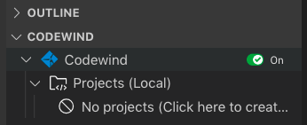

You're now ready to use the custom Appsody stack from within Codewind.


### Creating a new Codewind Project

We've seen how the Appsody CLI helps create, build and deploy projects based on stacks and templates.  Let's now see how Codewind augments the Appsody experience with tools for cloud-native development.

We're going to start by creating a new MicroProfile project. These first steps are the same for all the supported project types. 

To get started with writing the project, hover over the **Projects** entry underneath **Codewind** in **Visual Studio Code** and press the **+** icon to create a new project.


You should see a list of project types you can create.  The first one should be the custom Appsody project type, `Appsody Eclipse MicroProfile(r) Dev Mode template`.

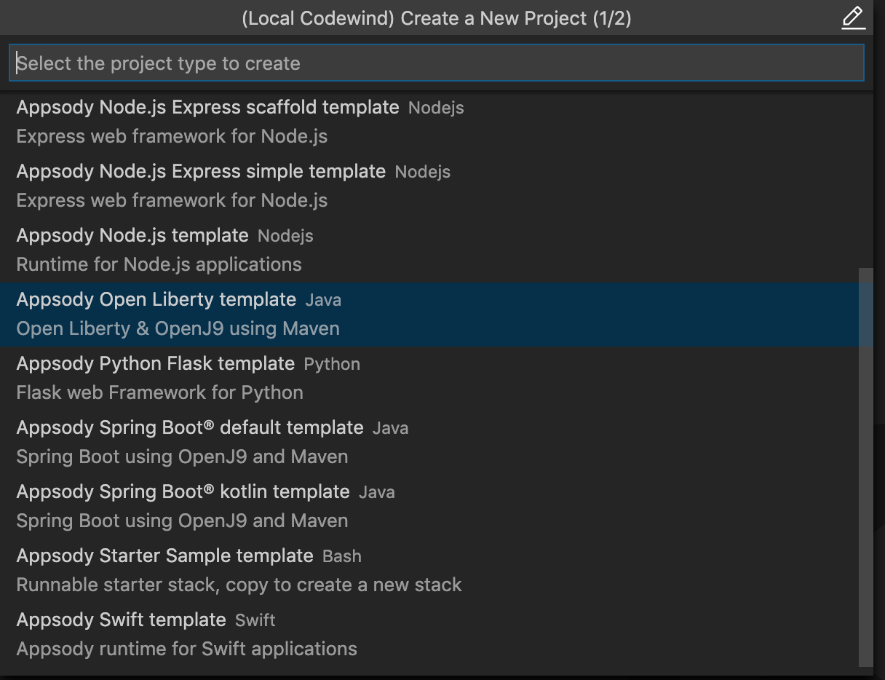

Select the `Appsody Eclipse MicroProfile(r) Dev Mode template` and in the next field give the project a name, e.g `kabanero-mp-project`

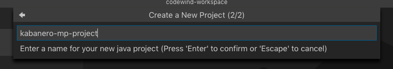

Press `Enter` to create the project.

The project has been generated and will now be building.  To see the progress, expand `Codewind` -> `Projects` and right click the menu options `Show all logs`:

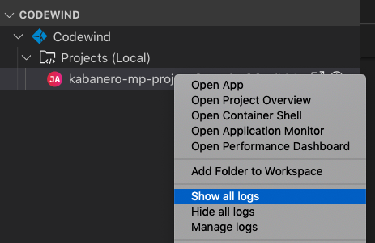

After a little while you should see the follow log message:

```
[Container] [INFO] [AUDIT   ] CWWKF0011I: The defaultServer server is ready to run a smarter planet. The defaultServer server started in 69.467 seconds.
```

And the state for the project should change to `Running`:

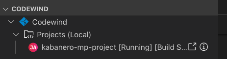

The generated project contains all the boiler-plate code to get started with developing a Java MicroProfile application.  This is the exact same code we saw generated for the new Appsody project.

To access the application endpoint in a browser, select the **Open App** icon  next to the project's name, or right-click on the project and select the `Open App` menu option. This opens up the application in the running container showing the `Welcome to your Appsody Microservice` page.

Let's take a look at the code.  In the **VS Code EXPLORER** you should see a `CODEWIND-WORKSPACE` entry with your project name.  If you don't find it, right-click on the project and choose `Add Folder to Workspace`.  In the workspace view, expand the project and the sub-folders to show all the files created from the Appsody template (Note, the template is not intended to be a sample as most people would end up having to delete the code each time, it aims to provide the starter code, server configuration and build to which you can add your code).


The main Java files are **StarterLivenessCheck**, **StarterReadinessCheck** and **StarterApplication**.  The first two provide the outlines for `liveness` and `readiness` checks that can be hooked up to `Kubernetes` liveness and readiness probes.  These are implemented using MicroProflie Health.  The third file is a JAX-RS application, which provides the `Application Path` for your REST API.

Let's add a REST service to your application.  Navigate to the `src/main/java/dev/appsody/starter` directory, and create a file called `StarterResource.java` - this will be our JAX-RS resource. Populate the file with the following code and save it:

```Java
package dev.appsody.starter;

import javax.ws.rs.GET;
import javax.ws.rs.Path;

@Path("/resource")
public class StarterResource {

    @GET
    public String getRequest() {
        return "StarterResource response";
    }
}
```

Any changes you make to your code will automatically be built and re-deployed by **Codewind**, and viewed in your browser. Let's see this in action.

If you still have the logs `OUTPUT` tab open you will see that the code is compiled and the application restarted. You should see messages like:

```
[Container] [INFO] Source compilation was successful.
[Container] [INFO] [AUDIT   ] CWWKT0017I: Web application removed (default_host): http://04013dbc9c11:9080/
[Container] [INFO] [AUDIT   ] CWWKZ0009I: The application starter-app has stopped successfully.
[Container] [INFO] [WARNING ] CWMH0053W: The readiness health check reported a DOWN overall status because the following applications have not started yet: [starter-app]
[Container] [INFO] [AUDIT   ] CWWKT0016I: Web application available (default_host): http://04013dbc9c11:9080/
```

Point your browser at the new resource (note, `<port>` is the port number you saw when you first opened the application):

```
http://127.0.0.1:<port>/starter/resource
```

You should see the following response:

```
StarterResource response
```

### Looking Inside the Container

During development you may need to look inside the container to see what's deployed and configured.  Codwind makes this easy.  Select the `Open Container Shell` option:

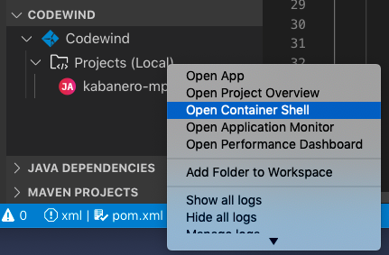

The following shows the files and location where the shell opens inside the container.  This is the root of your project.

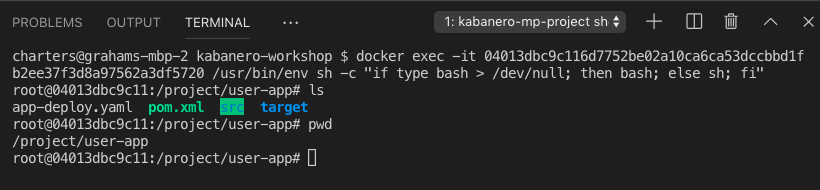

You can navigate around the `src` and `target` directories to see the code on disk and the Liberty server and built application deployment.

### Viewing Application Metrics

Let's take a look at the application metrics built in to Codewind.  Right-click on the application and select `Open Application Monitor`:

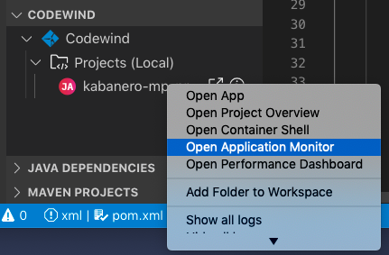

This should open a page in your browser showing the java metrics dashboard with CPU, HTTP, Heap and GC data.  To make it more interesting, hit the REST endpoint a few times to see the effects.  You should end up with a dashboard looking something like:

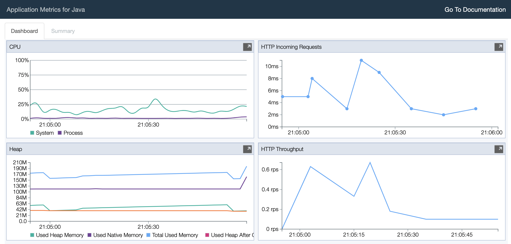

The dashboard helps you understand the runtime characteristics of your service.  Keep the dashboard open for now.

### Running Load Tests

Let's now take a look at the load testing support of Codewind.  Right-click on the application and select `Open Performance Dashboard`:

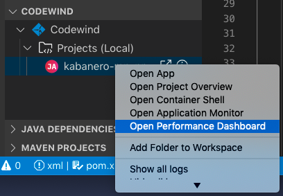

In a browser tab you should see the Codewind performance dashboard.  Click on `Edit load run settings` and change the path to point to the REST service endpoint `/starter/resource` and click `Save` to save the settings.  Click `Run Load Test`, in the dialog, give the test a name `Test 1` and choose `Run`:

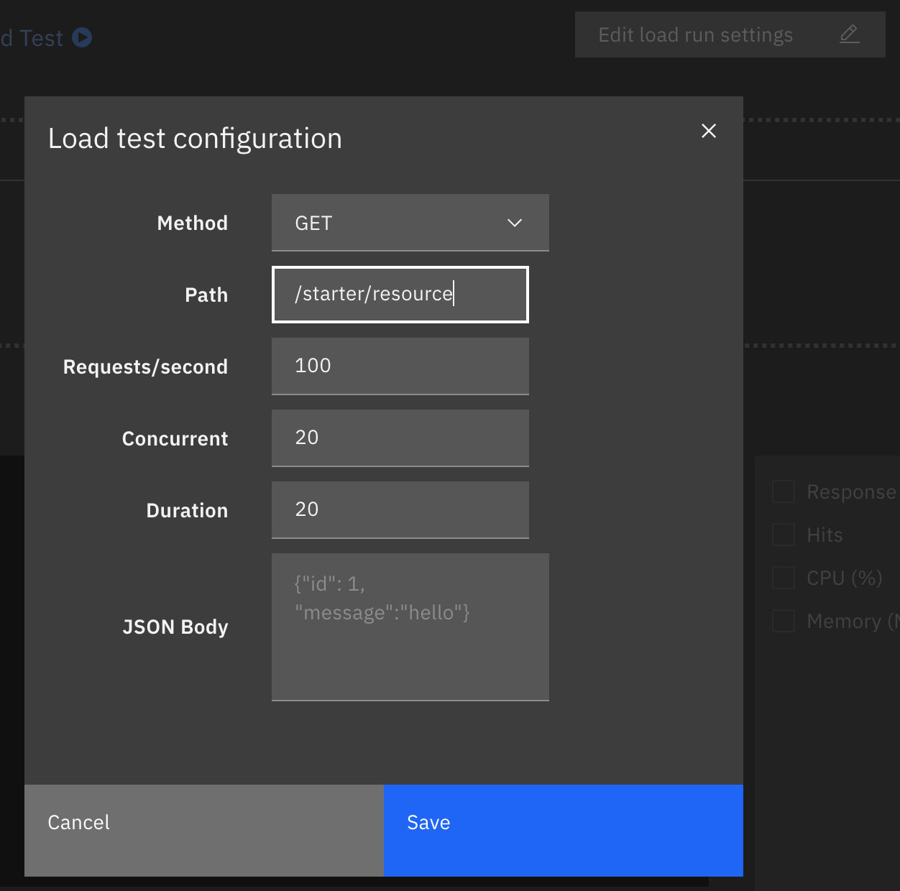

When the tests are complete you should see results similar to the following (you may need to click refresh in the browser).  Click the check-boxes for `Response`, `Hits`, `CPU` and `Memory`.

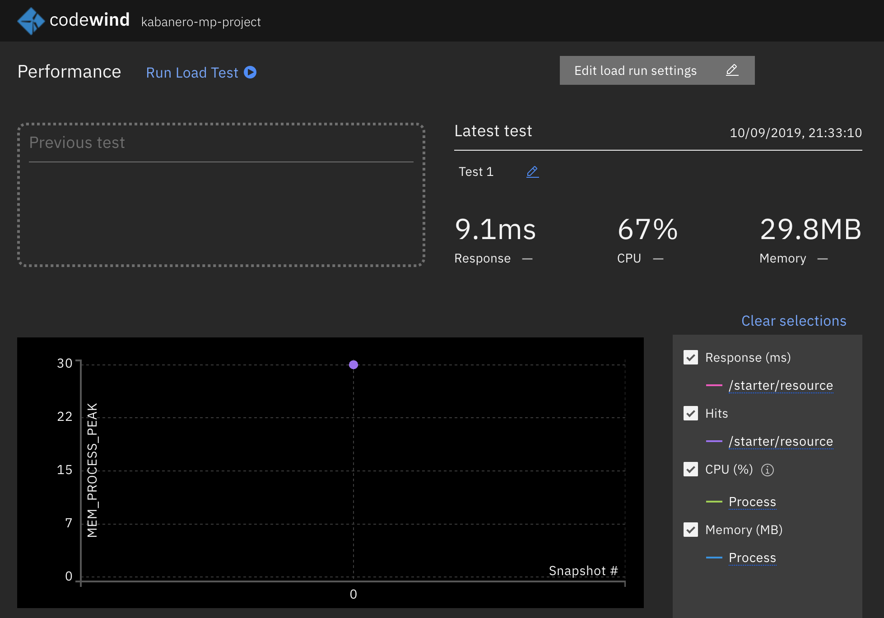

To see the effect of the load test on the service, take a look at the metrics dashboard you opened earlier.  You should see spikes in the various measures.

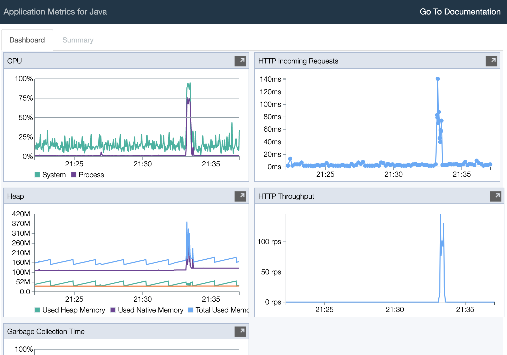

Let's do some development and degrade the performance of the services.  Update the `GET` method with the following and save the file.  As before, the application will be automatically updated:

```Java
    @GET
    public String getRequest() {
        try {
            Thread.sleep(100);
        } catch (InterruptedException e) {
            e.printStackTrace();
        }
        return "StarterResource response";
    }
  ```

In the performance dashboard, click `Run Load Test`, give the test another name, e.g. `Test 2`, and click `Run`.  When the tests complete, you should see results similar to the following:

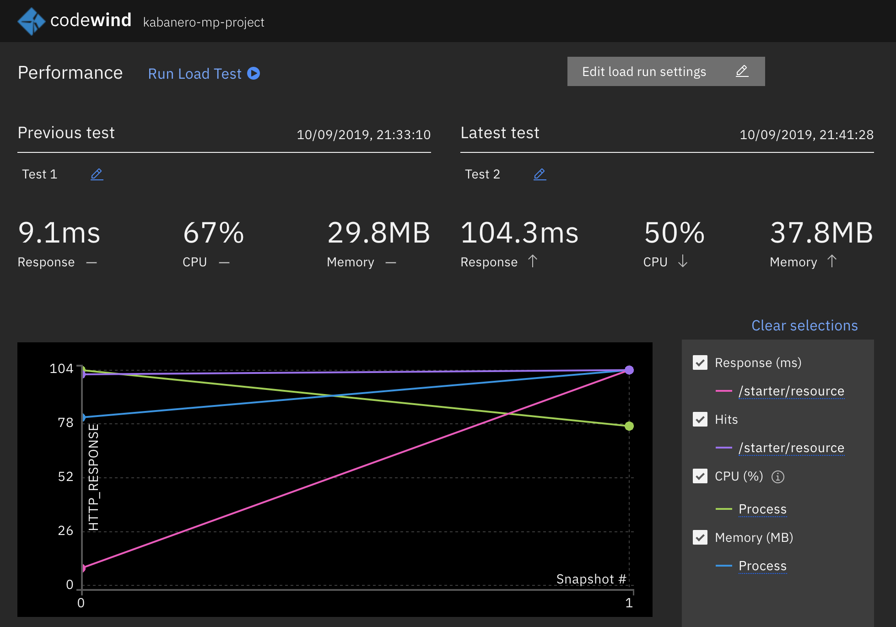

We can see clearly from the chart that the response time has increased.  Revisit the metrics dashboard and we can also see the response time increase:

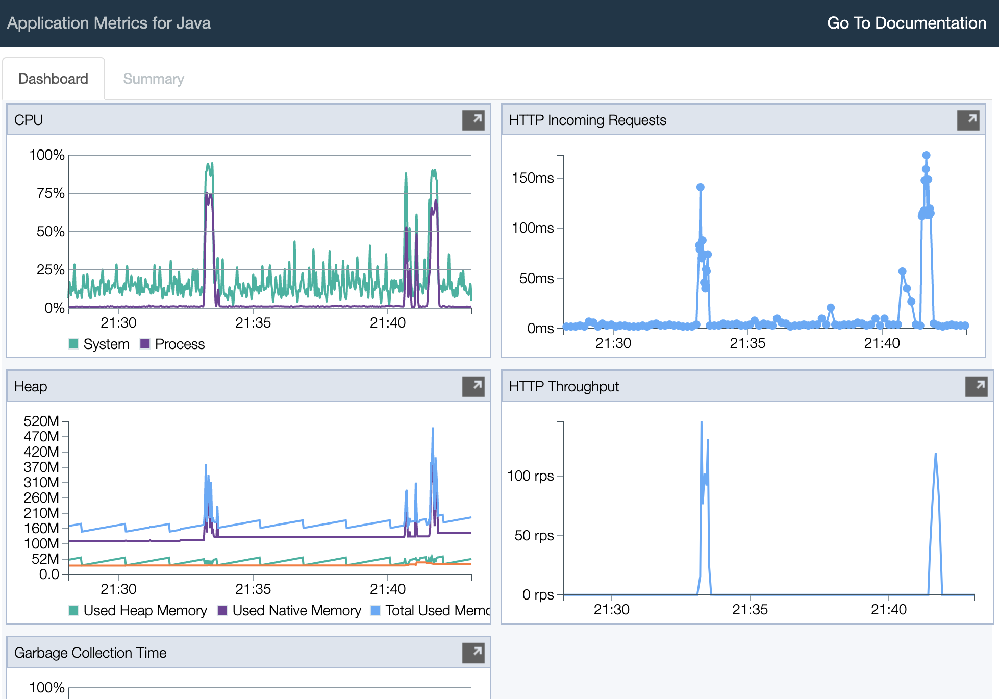

### Deploy the Project to Knative or Kubernetes via the CLI

The project you created is a normal Appsody project and so can be worked with using the Appsody CLI. As per the Appsody part of this workshop, deploy the application to Kubernetes using:

```
 $ appsody deploy
```

If this was successful, the output of this command should be:
```
Deployed project running at http://localhost:<port>
```

Test the endpoint by opening:

```
http://127.0.0.1:<port>/starter/resource
```

You should see the following response:

```
StarterResource response
```

Undeploy the application using:

```
appsody deploy delete
```

Locate the deployment which hosts your application through the following command:

```
$ kubectl get all
```

Copy the deployment's URL into a browser. Congratulations! Your application is now accessible through Knative/Kubernetes.


## Working with Appsody Collections

_Introduce the Collection concept.  Talk about Stacks and Templates (these will have been talked about at a high level, but the details of the files will not have been covered._

A collection includes everything you need to create a microservice in a single container image, along with an enterprise-grade deployment & integrated continuous delivery choice. Collections are developed by application architects to match their organizational and product requirements and work as the basis for applications created by application developers.

A collection is defined by a combination of a stack (container images and application templates), build/CD conventions, and deployment best-practices. 

The workshop will cover various aspects of the customization of an existing collection, which will better prepare you for eventually creating an entirely new collection after the workshop. The entire process for creating a new collection is described in the ["Creating a Stack"](https://appsody.dev/docs/stacks/create) section of the Appsody website.


### Stacks ###

A [stack](https://appsody.dev/docs/stacks/stacks-overview) contains at least one pre-built container image, with the resulting runtime being tailored to the target runtime. An application architect may  to specify different tunning parameters for a single image, such as dynamic code reloading for development environments, or provide distinct images for different purposes, such as an image stripped out of shell support for production environments.

You can study the internal file structure of a stack in more detail [here](https://appsody.dev/docs/stacks/stack-structure).


#### Collection Scenario 1: Update the release of Open Liberty in the stack ####

The first part of the workshop used the custom "experimental/java-microprofile-dev-mode" stack. In this scenario, a new version of Open Liberty is released and you, as the application architect, want all applications based on this stack to be migrated to the latest release in the next development and deployment cycle.

The first step is to clone the stack, which was already executed by the prerequisite preparation steps:

```
workshop_dir=$(echo ~)"/workspace/kabanero-workshop"

[ ! -e "${workshop_dir}/stacks" ] && \
( mkdir -p "${workshop_dir}"
  cd "${workshop_dir}"
  git clone https://github.com/gcharters/stacks )

```

In this stack, the [container image file](https://github.com/gcharters/stacks/blob/master/experimental/java-microprofile-dev-mode/image/project/Dockerfile) specifies the usage of Maven as the build tool, and we can see the version of Open Liberty in the "properties" section of the master [pom.xml file](https://github.com/gcharters/stacks/blob/master/experimental/java-microprofile-dev-mode/image/project/pom.xml) in that same directory:

```pom.xml
<version.openliberty-runtime>19.0.0.7</version.openliberty-runtime>
```

You can now modify the Open Liberty version to 19.0.0.8, then use the `grep` command to inspect the change:
```
sed -i "" "s|19.0.0.7|19.0.0.8|g" "${workshop_dir}/stacks/experimental/java-microprofile-dev-mode/image/project/pom.xml"

grep "19.0.0" "${workshop_dir}/stacks/experimental/java-microprofile-dev-mode/image/project/pom.xml"
```

With the version changed, we need to rebuild the stack before proceeding with the stack validation steps:

```
cd "${workshop_dir}/stacks"
./ci/build.sh . experimental/java-microprofile-dev-mode
```

Since this local stack build was registered as an Appsody repository in the first part of the workshop, there is no need to register it again. It is now time to verify the changes from the perspective of the application developer. We can go back to the original application directory and trigger another run, which will use the updated stack:

```
cd "${workshop_dir}/java-example"

appsody run
```

As the application starts, we can see output lines indicating the newer version of Open Liberty, which completes the scenario:

```
...

[Container] [INFO] --- liberty-maven-plugin:3.0.M1:install-server (create-server) @ starter-app ---
[Container] [INFO] CWWKM2102I: Using artifact based assembly archive : io.openliberty:openliberty-runtime:null:19.0.0.8:zip
...
```

End the application with `Ctrl+C`.


#### Collection Scenario 2: Custom application template #### 

A stack contains at least one application template, which is the set of application files placed in the application directory during the initial creation of a project. Templates named "default" are used by `appsody init` when the user does not specify a template name. An application architect can create new templates to reflect different starting points for application developers, such as a default template for a simple stateless application or a more complex template with starter code for connecting to a remote database.

In this scenario, we will inspect an alternative template with a postgresql database connection endpoint, then create and test an application starter using that template.

We first need to take a look at the alternative template, which is located in the "templates" folder:

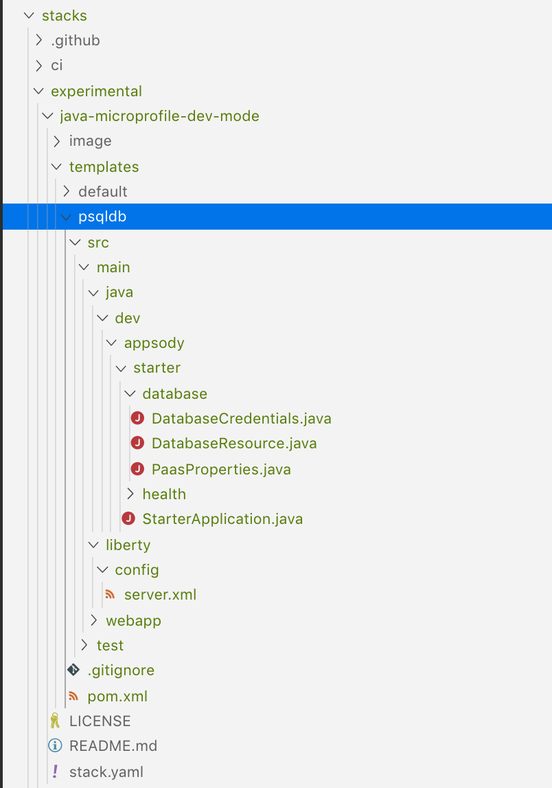

DatabaseResource.java implements a "/database" JAX-RS path under the root context for the application, it relies on PaasProperties.java to read the connection parameters. Those parameters are hardcoded for this workshop, but a template meant for actual production environments should read that information from a secret mounted to the pod or container.

You will also notice the addition of the postgresql JDBC driver to the pom.xml file in the template.

Our second step is to instantiate a local PostgreSQL database. We will use a custom docker network for both the PostgreSQL database container and the application container, which makes it easier for the application container to locate the database container by hostname instead of IP address.

```
docker network create workshop_nw

# Start postgresql
docker run --rm -it --name workshop-postgres --hostname psqldb --network workshop_nw -e POSTGRES_PASSWORD=mysecretpassword -d postgres 
```

Ensure the database container is running:

```
docker ps | grep workshop-postgres

b66c53a3be0f        postgres                                                  "docker-entrypoint.s…"   22 seconds ago      Up 21 seconds       5432/tcp                    workshop-postgres
```


```

mkdir -p "${workshop_dir}/stacktest-db"
cd "${workshop_dir}/stacktest-db"
appsody init workshop/java-microprofile-dev-mode psqldb

appsody run --network workshop_nw
```

Wait for the application to complete its startup cycle and verify that the new endpoint is available:

```
curl -s http://localhost:9080/starter/database/  | tr -s "," "\n"
{"client.info.ApplicationName":"PostgreSQL JDBC Driver"
"db.product.name":"PostgreSQL"
"db.product.version":"11.5 (Debian 11.5-1.pgdg90+1)"
"db.major.version":11
"db.minor.version":5
"db.driver.version":"42.2.6"
"db.jdbc.major.version":4
"db.jdbc.minor.version":2}
```

End the application with `Ctrl+C`, stop the workshop-postgres container, and delete the custom network:

```
docker stop workshop-postgres
docker network rm workshop_nw
```


### Build/CD ###

A collection also specifies how applications should be built and packaged, encoding conventions about compilation aspects, packaging tooling, unit test enforcement, static code analysis, and many others. A full Kabanero toolchain is implemented as a sequence of steps that happen both inside and outside the container boundaries, and this workshop covers the steps that happen within the container boundaries, such as compilation and packaging of binaries.

This portion of the instructions is executed directly when the developer invokes `appsody build` or implicitly, when the developer invokes `appsody deploy` and there are outstanding code changes since the last build.

#### Collection Scenario 3: Add static code verification to build process ####

 In this scenario, the entire team discussed ways of making code reviews more efficient and agreed on ensuring minimal coding guidelines for all applications based on that stack. 

After considering multiple tools, the team agreed on using [Checkstyle](https://maven.apache.org/plugins/maven-checkstyle-plugin/usage.html) , and the application architect can make that modification to the stack image itself. 

For simplicity we will use the default checkstyle rules, so that we just need to add the ` checkstyle:check` goal to the `mvn` invocation in the application Dockerfile, located under:

```
${workshop_dir}/stacks/experimental/java-microprofile-dev-mode/image/project/Dockerfile
```

Change the following line from:
```
RUN mvn install -DskipTests
```

to

```
RUN mvn checkstyle:checkstyle install -DskipTests -Dcheckstyle.consoleOutput=true
```

With the change in place, we can rebuild the stack again:

```
cd "${workshop_dir}/stacks"
./ci/build.sh . experimental/java-microprofile-dev-mode
```

And we can verify that the new code verification step is executed when an application developer executes `appsody build`:

```
cd "${workshop_dir}/java-example"
appsody build

...

>>> [Docker] Step 8/13 : RUN mvn checkstyle:check install -DskipTests
[Docker]  ---> Running in 22765b6b6301
...
[Docker] [INFO] Starting audit...
[Docker] [ERROR] /project/user-app/src/main/java/dev/appsody/starter/health/StarterReadinessCheck.java:1: Missing package-info.java file. [JavadocPackage]
...
[Docker] [ERROR] /project/user-app/src/main/java/dev/appsody/starter/StarterApplication.java:6: Missing a Javadoc comment. [JavadocType]
[Docker] Audit done.
[Docker] [INFO] There are 17 errors reported by Checkstyle 8.19 with sun_checks.xml ruleset.
...
```

#### Collection Scenario 4: Stack versioning  #### 

Appsody supports [semantic versioning](https://semver.org/) during development of stacks and applications. Notice how the checkstyle modification from the previous scenario does not fail the build process, but instead prints a summary of errors for the developer.

This decision was done by design, as an application architect may want to give some time for the whole team to address the errors without suddenly disrupting their workflow.

In this scenario, we want to show how the application architect could release a new version of the stack that will not automatically get picked up by developers immediately after release, so we need to understand how Appsody tags stack images.

The initial version of the stack used in this workshop is 0.2.10, which is listed in the output of `appsody list`. During compilation of the stack, you will notice how Appsody creates 4 docker images:

```
> docker images appsody/java-microprofile-dev-mode 
REPOSITORY                           TAG                 IMAGE ID            CREATED             SIZE
appsody/java-microprofile-dev-mode   0                   ad81b68a6079        2 hours ago         1.07GB
appsody/java-microprofile-dev-mode   0.2                 ad81b68a6079        2 hours ago         1.07GB
appsody/java-microprofile-dev-mode   0.2.10              ad81b68a6079        2 hours ago         1.07GB
appsody/java-microprofile-dev-mode   latest              ad81b68a6079        2 hours ago         1.07GB
```

`appsody init` will always configure the application to use the version with two digits, which is "0.2" in this case:

```
cd "${workshop_dir}/java-example
cat .appsody-config.yaml

stack: appsody/java-microprofile-dev-mode:0.2
```

That means application developers will see their next call to `appsody run` to automatically pick up new images tagged 0.2 when the application architect releases any stack with a tag name starting with "0.2.", such as "0.2.11".

For this scenario, we want to modify the stack to actually break the build in case of problems with the static code analysis and tag the release as 0.3.1. We first replace all occurrences of 0.2.10 with 0.3.1:


```
cd "${workshop_dir}/stacks"

 find ./experimental/java-microprofile-dev-mode -type f -exec grep -q "0.2.10" {} \; -print  | xargs -Irepl sed -i "" "s|0.2.10|0.3.1|g" repl
```

Then we inspect the changes to ensure the old version was replaced across all affected files:

```
find ./experimental/java-microprofile-dev-mode -type f -exec grep "0.3" {} \; -print 
version: 0.3.1
./experimental/java-microprofile-dev-mode/stack.yaml
    <version>0.3.1</version>
./experimental/java-microprofile-dev-mode/image/project/pom.xml
        <version>0.3.1</version>
./experimental/java-microprofile-dev-mode/templates/default/pom.xml
```

We can now replace the `checkstyle:checkstyle` goal in the `mvn` invocation with `checkstyle:check`, which will fail the build in case of violations of coding guidelines.

Once again, we are modifying the application Dockerfile, located under:

```
${workshop_dir}/stacks/experimental/java-microprofile-dev-mode/image/project/Dockerfile
```

Change the following line from:
```
RUN mvn checkstyle:checkstyle install -DskipTests -Dcheckstyle.consoleOutput=true
```

to

```
RUN mvn checkstyle:check install -DskipTests -Dcheckstyle.consoleOutput=true
```


With the stack version and checkstyle goal updated, we can build the stack one last time:

```
cd "${workshop_dir}/stacks"
./ci/build.sh . experimental/java-microprofile-dev-mode
```

Now you will notice the new stack images and how 0.2 and 0.2.10 were left untouched.

```
docker images appsody/java-microprofile-dev-mode 

REPOSITORY                           TAG                 IMAGE ID            CREATED              SIZE
appsody/java-microprofile-dev-mode   0                   37738c47f510        About a minute ago   1.07GB
appsody/java-microprofile-dev-mode   0.3                 37738c47f510        About a minute ago   1.07GB
appsody/java-microprofile-dev-mode   0.3.1               37738c47f510        About a minute ago   1.07GB
appsody/java-microprofile-dev-mode   latest              37738c47f510        About a minute ago   1.07GB
appsody/java-microprofile-dev-mode   0.2                 ad81b68a6079        3 hours ago          1.07GB
appsody/java-microprofile-dev-mode   0.2.10              ad81b68a6079        3 hours ago          1.07GB
```

With the new stack generated, the application architect will notify developers who are ready to make the switch to the new version about the stack availability, at which point the application developers can modify the appsody configuration in their application directory:

Modify the version in "${workshop_dir}/java-example/.appsody-config.yaml" from 0.2 to 0.3

After saving the modification, you should see the following output:

```
> cat .appsody-config.yaml
stack: appsody/java-microprofile-dev-mode:0.3
```

Now modify the version in "pom.xml" from 0.2.10 to 0.3.1.
After saving the modification, you should see the following output:

```
> grep 0.3 pom.xml
        <version>0.3.1</version>
```

With the new changes in place, and with the application updated to use the latest version of the stack, requests to `appsody build` will fail in case of static analysis errors:

```
> appsody build

...
[Docker] Step 8/13 : RUN mvn checkstyle:check install -DskipTests -Dcheckstyle.consoleOutput=true
...
[Docker] [ERROR] src/main/java/dev/appsody/starter/StarterApplication.java:[6] (javadoc) JavadocType: Missing a Javadoc comment.
[Docker] [INFO] ------------------------------------------------------------------------
[Docker] [INFO] BUILD FAILURE
[Docker] [INFO] ------------------------------------------------------------------------
[Docker] [INFO] Total time:  5.727 s
[Docker] [INFO] Finished at: 2019-09-06T22:37:46Z
[Docker] [INFO] ------------------------------------------------------------------------
[Docker] [ERROR] Failed to execute goal org.apache.maven.plugins:maven-checkstyle-plugin:3.1.0:check (default-cli) on project starter-app: You have 84 Checkstyle violations. -> [Help 1]
...
[Docker] [ERROR] [Help 1] http://cwiki.apache.org/confluence/display/MAVEN/MojoFailureException
[Docker] The command '/bin/sh -c mvn checkstyle:check install -DskipTests -Dcheckstyle.consoleOutput=true' returned a non-zero code: 1
[Error] exit status 1

```

#### Further reading: Development versus production behaviour ####

The previous scenario showed a simple change, but Kabanero collections can accommodate more sophisticated behaviours, where the container image is setup with additional debugging capabilitites during development and stripped out of those capabilities during production. This [Git pull request](https://github.com/appsody/stacks/pull/56) shows how that type of different behaviour can be achieved, by exploring the usage of [different modes of a stack](https://appsody.dev/docs/stacks/stack-structure): 'initialization', 'rapid local development', and 'build and deploy'. 
