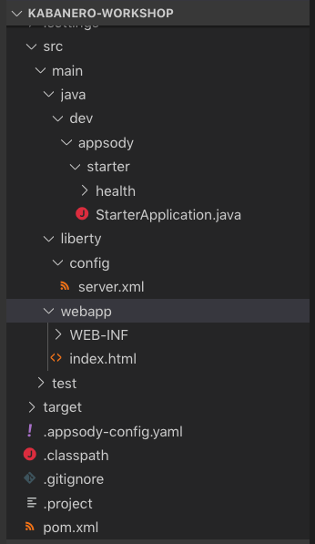
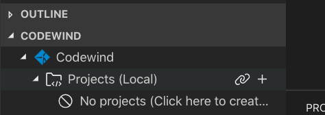
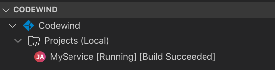

# Kabanero Developer Experience - Getting Started

Kabanero is an open source project focused on bringing together key foundational open source technologies into a framework for developing and deploying modern cloud-native applications.  The Kabanero developer experience leverages the Appsody and Eclipse Codewind open source projects enabling developers to use project 'templates' to rapidly create new cloud-native applications, develop and build them in a curated container 'stack' environment and deploy them to Knative/Kubernetes all without the need for container or Kubernetes skills.

This tutorial will give you an introduction to the Kabanerio developer experience. You'll create and deploy a Java MicroProfile based cloud-native application, however, Kabanero provides a number of stacks, including Node.js and Spring Boot and is extensible so others can easily be added. For more information, see [Appsody.dev](https://appsody.dev/).

At the end of this tutorial, you should have a good understanding of the Kabanerio developer experience through the use of Appsody and Eclipse Codewind.  You'll know how to create a new application, develop and deploy it to Knative and have an appreciation for how Kabanero does all the heavy-lifting helping you focus on the task of writing the code.


## Table of Contents
- [Kabanero Developer Experience - Getting Started](#kabanero-developer-experience---getting-started)
  - [Table of Contents](#table-of-contents)
  - [Before You Begin](#before-you-begin)
    - [Pre-requisites](#pre-requisites)
    - [Enable Kubernetes](#enable-kubernetes)
    - [Visual Studio Code Kabanero Setup](#visual-studio-code-kabanero-setup)
      - [Installing the Codewind Extension for Visual Studio Code](#installing-the-codewind-extension-for-visual-studio-code)
    - [Installing the Appsody Extension for Codewind](#installing-the-appsody-extension-for-codewind)
    - [CLI Kabanero Setup](#cli-kabanero-setup)
      - [Installing the Appsody CLI](#installing-the-appsody-cli)
      - [Sharing the Appsody Configuration between the CLI and Visual Studio Code - Optional](#sharing-the-appsody-configuration-between-the-cli-and-visual-studio-code---optional)
    - [Priming the Maven and Docker caches - Denilson to update](#priming-the-maven-and-docker-caches---denilson-to-update)
  - [Developing Cloud-native applications - Appsody](#developing-cloud-native-applications---appsody)
    - [Getting to know Appsody](#getting-to-know-appsody)
    - [Creating a new Project with Appsody](#creating-a-new-project-with-appsody)
    - [Live coding with Appsody](#live-coding-with-appsody)
    - [Deploying to Kubernetes](#deploying-to-kubernetes)
  - [Developing Cloud-native applications - Codewind](#developing-cloud-native-applications---codewind)
    - [Create an Appsody Project via the CLI](#create-an-appsody-project-via-the-cli)
    - [Writing the Code](#writing-the-code)
    - [Deploy the Project to Knative or Kubernetes via the CLI](#deploy-the-project-to-knative-or-kubernetes-via-the-cli)
  - [Working with Appsody Collections](#working-with-appsody-collections)

## Before You Begin
Before you get started, there are a number of pre-reqs you'll need to install.  These are the pre-reqs for developing a Java MicroProfile application using Kabanero.  Different pre-reqs will be required for other application stacks.

### Pre-requisites

You need to install the following pre-requisites to complete this tutorial.

* [A Java 8 JDK Installation](https://adoptopenjdk.net/?variant=openjdk8&jvmVariant=openj9)
* [Apache Maven](https://maven.apache.org/)
* Docker
  * [Windows Docker Installation](https://docs.docker.com/docker-for-windows/)
  * [MacOS Docker Installation](https://docs.docker.com/docker-for-mac/)
* [Visual Studio Code](https://code.visualstudio.com/)

### Enable Kubernetes

You will need to enable Kubernetes as this is disabled by default in Docker Desktop. This can be done by going to **Preferences**, navigating to the **Kubernetes** tab, and checking **Enable Kubernetes**.

### Visual Studio Code Kabanero Setup

#### Installing the Codewind Extension for Visual Studio Code
Eclipse Codewind provides a set of extension to IDEs for doing cloud-native application development.  The enable a full developer/debug cycle with incremental build where all the code is built and run inside a container.  This means that the likelihood of issues due to different development, build and production environments is vastly reduced.

Although Codewind is an Eclipse project, it's not limited to the Eclipse IDE and in this tutorial you will use Codewin inside Visual Studio Code.

Codewind requires Docker, so before you begin, ensure your Docker install is complete and running.

To install the **Codewind Extension** for **Visual Studio Code**, you have two options.

1. Install using the **Install** button on [this page](https://marketplace.visualstudio.com/items?itemName=IBM.codewind).

2. Manually launch Visual Studio Code, navigate to the **Extensions** view, search for **Codewind**, and install the extension from here.

### Installing the Appsody Extension for Codewind

Codewind comes with a set of pre-defined `templates` for various project types, but the Kabanero recommendation is to use those provided by Appsody.  To do this requires an Appsody extension to Codewind.

To install **Appsody** for **Codewind**, follow the instructions from the **Appsody Codewind Extension** [repository](https://github.com/kabanero-io/appsodyExtension#installing-the-appsody-extension-on-codewind)

### CLI Kabanero Setup

#### Installing the Appsody CLI
Depending on your operating system, the installation process for the **Appsody CLI** will differ. To correctly install **Appsody** for your operating system, view the following [link](https://appsody.dev/docs/getting-started/installation).

Verify that the CLI tool is installed correctly by executing the following into your terminal:

```
$ appsody
```


 **TODO:** *The following section is no longer required but we do need to teach Codewind about the custom stack*

#### Sharing the Appsody Configuration between the CLI and Visual Studio Code - Optional
While this is optional, it is recommended. Rather than having **Appsody CLI** projects stored separately to those you may create in an editor such as **Visual Studio Code** or **Eclipse**, updating the **Appsody** configuration file will enable you to work on your projects across both the CLI and editor.

To share the Appsody configuration, follow the instructions at [this repository](https://github.com/kabanero-io/appsodyExtension#optional-using-the-same-appsody-configuration-between-local-cli-and-codewind).

### Priming the Maven and Docker caches

This step will bring in large images into your local docker images repository. The cached images will save you time and bandwidth at the beginning of the workshop.

```
curl -sL https://github.com/gcharters/kabanero-dev-getting-started/releases/download/0.0.1/appsody-prime-caches.sh | bash
```

This step will download most of the Java dependencies into your local disk. The cached dependencies will also save you time and bandwidth at the beginning of the workshop.

```
cd ${tmp_dir}/stacks/experimental/java-microprofile-dev-mode
mkdir -p ~/.m2
// TODO use appsody run and ctrl-C
docker run --rm -it -v ~/.m2:/root/.m2 -v "$PWD/image/project:/project" maven mvn -f /project/pom.xml dependency:resolve
```


## Developing Cloud-native applications - Appsody

### Getting to know Appsody

We're going to start by trying out the developer experience Appsody provides and then we'll move on to use Eclipse Codewind.

Let's take a look at what Appsody provides in terms of capabilities.  In a comamnd prompt, type:

```
appsody
```

You should see output similar to the following:

```
charters@Grahams-MBP-2 ~ $ appsody
The Appsody command-line tool (CLI) enables the rapid development of cloud native applications.

Complete documentation is available at https://appsody.dev

Usage:
  appsody [command]

Available Commands:
  build       Locally build a docker image of your appsody project
  completion  Generates bash tab completions
  debug       Run the local Appsody environment in debug mode
  deploy      Build and deploy your Appsody project to your Kubernetes cluster
  extract     Extract the stack and your Appsody project to a local directory
  help        Help about any command
  init        Initialize an Appsody project with a stack and template app
  list        List the Appsody stacks available to init
  operator    Install or uninstall the Appsody operator from your Kubernetes cluster.
  repo        Manage your Appsody repositories
  run         Run the local Appsody environment for your project
  stop        Stops the local Appsody docker container for your project
  test        Test your project in the local Appsody environment
  version     Show Appsody CLI version

Flags:
      --config string   config file (default is $HOME/.appsody/.appsody.yaml)
      --dryrun          Turns on dry run mode
  -h, --help            help for appsody
  -v, --verbose         Turns on debug output and logging to a file in $HOME/.appsody/logs

Use "appsody [command] --help" for more information about a command.
```

The Appsody CLI has a number of **Commands**.  The majority of these commands are for working  with stacks: build, debug, run stop, test, and extract, list.

Let's take a look at what stacks we have available by entering:

```
appsody list
```

This command lists the available stacks and you should see something like:

```
charters@Grahams-MBP-2 ~ $ appsody list

REPO                 	ID                        	VERSION  	TEMPLATES	DESCRIPTION                                              
appsodyhub           	java-microprofile         	0.2.11   	*default 	Eclipse MicroProfile using OpenJ9 and Maven              
appsodyhub           	java-spring-boot2         	0.3.8    	*default 	Spring Boot using OpenJ9 and Maven                       
appsodyhub           	nodejs                    	0.2.5    	*simple  	Runtime for Node.js applications                         
appsodyhub           	nodejs-express            	0.2.5    	*simple  	Express web framework for Node.js                        
appsodyhub           	nodejs-loopback           	0.1.3    	*scaffold	LoopBack API framework for Node.js                       
appsodyhub           	swift                     	0.1.4    	*simple  	Runtime for Swift applications
```

You'll see that with the stacks available, we can develop new cloud-native applications using Java, Node or Swift, with a number of different, popular frameworks.

These are the default stacks that Appsody provides.  We're going to use a custom stack and to do so we need ot take a look at where the stacks come from.  This is where the concept of repositories comes in.  Type the following:

```
appsody repo list
```

You should see an output similar to this:

```
charters@Grahams-MBP-2 ~ $ appsody repo list

NAME                 	URL                                                                                    
*appsodyhub          	https://raw.githubusercontent.com/appsody/stacks/master/index.yaml                     
```

`Appsodyhub` is the location where the appsody project releases its stacks.  The `*` indicates that this is the default repository.

We're going to use a custom stack created for this workshop.  Anybody can write a stack or customize a stack for use by others. Maybe you want to add support for another language or framework, or perhaps your company has additional governance requirements that you want to add into an existing stack.  We'll go into more details on stack development later, but for now, let's add in the stack we'll use in this part of the workshop.

As part of the setup for the workshop, you cloned a github repository and built a project that contained the new stack. Let's go to the output of that build:

```
cd ${tmp_dir}/stacks/ci/assets
```

If you list the contents of that directory, you should see something like this:

```
charters@Grahams-MBP-2 assets (master) $ ls
experimental-index-local.yaml
experimental-index.yaml
experimental.java-microprofile-dev-mode.templates.default.tar.gz
experimental.java-microprofile-dev-mode.v0.2.10.templates.default.tar.gz
experimental.java-microprofile-dev-mode.v0.2.6.templates.default.tar.gz
experimental.java-spring-boot2-liberty.templates.default.tar.gz
experimental.nodejs-functions.templates.simple.tar.gz
experimental.nodejs-loopback.templates.scaffold.tar.gz
experimental.quarkus.templates.default.tar.gz
incubator-index-local.yaml
incubator-index.yaml
incubator.java-microprofile.templates.default.tar.gz
incubator.java-spring-boot2.templates.default.tar.gz
incubator.java-spring-boot2.templates.kotlin.tar.gz
incubator.nodejs-express.templates.simple.tar.gz
incubator.nodejs-express.templates.skaffold.tar.gz
incubator.nodejs.templates.simple.tar.gz
incubator.swift.templates.simple.tar.gz
stable-index-local.yaml
stable-index.yaml
```

This contains the stack packages (.tar.gz files) and local/remote repository files for the `stable`, `incubator` and `experimental` stacks.  The stack we want to use is in the `experimental` repository.

Let's add the local repository definition to the set of repositories that the Appsody CLI can use:

```
appsody repo add workshop file://$(PWD)/experimental-index-local.yaml
```

Check the repository has been added:

```
appsody repo list
```

You should see:

```
charters@Grahams-MBP-2 assets (master) $ appsody repo list

NAME       	URL                                                                                      
*appsodyhub	https://raw.githubusercontent.com/appsody/stacks/master/index.yaml                       
workshop   	file:///Users/charters/Repositories/github/stacks/ci/assets/experimental-index-local.yaml
```

Let's see what stacks we now have available:

```
appsody list
```

You should now see an entry for a stack called `java-microprofile-dev-mode` from the `workshop` repository.

```
charters@Grahams-MBP-2 ~ $ appsody list

REPO      	ID                        	VERSION  	TEMPLATES	DESCRIPTION                                              
appsodyhub	java-microprofile         	0.2.11   	*default 	Eclipse MicroProfile using OpenJ9 and Maven              
appsodyhub	java-spring-boot2         	0.3.8    	*default 	Spring Boot using OpenJ9 and Maven                       
appsodyhub	nodejs                    	0.2.5    	*simple  	Runtime for Node.js applications                         
appsodyhub	nodejs-express            	0.2.5    	*simple  	Express web framework for Node.js                        
appsodyhub	nodejs-loopback           	0.1.3    	*scaffold	LoopBack API framework for Node.js                       
appsodyhub	swift                     	0.1.4    	*simple  	Runtime for Swift applications                           
workshop  	java-microprofile-dev-mode	0.2.10   	*default 	Eclipse MicroProfile on Open Liberty & OpenJ9 using Maven
```

We're now ready to start creating applications using the new Appsody stack.  

### Creating a new Project with Appsody

Make a directory to contain your project:

```
mkdir ~/kabanero-workshop
cd ~/kabanero-workshop
```

Create the new project.  This project will using the Java MicroProfile APIs defined at Eclipse and will run on the open source Open Liberty runtime running on Eclipse Open J9.

```
appsody init workshop/java-microprofile-dev-mode
```

When the build completes you should see something like:

```
...
[InitScript] [INFO] ------------------------------------------------------------------------
[InitScript] [INFO] BUILD SUCCESS
[InitScript] [INFO] ------------------------------------------------------------------------
[InitScript] [INFO] Total time: 0.800 s
[InitScript] [INFO] Finished at: 2019-09-02T15:52:41+01:00
[InitScript] [INFO] ------------------------------------------------------------------------
Successfully initialized Appsody project
```

Open up the project in VS Code.  

```
code .
```

Note, we're not using Codewind at this point.  If you prefer, you can use other IDEs. To experience the incremental update during development you will need an IDE that automatically compiles Java source files each time they are saved.  VS Code (with the Red Hat `Language Support for Java`), Eclipse and IntelliJ IDEA are all known to work.

Expand the project `src` and you should see a structure and code like this:



This is intentionally a 'bare-bones' project so as to avoid the need to delete unnecessary files.  It contains a JAX-RS Application class called `StarterApplication.java`, and Liberty server configuration, `server.xml`, and static html file, `index.html` and the project build file, `pom.xml`

### Live coding with Appsody

Let's start the new application ready to make some edits.  Enter the following command:

```
appsody run
```

The run command for this stack has been set up to ensure the compiled code is up to date and then launch the Open Liberty server with the application deploy in `dev mode`.  Dev mode is Open Liberty's support for hot application update during development.

After a while you should see output similar to the following: 

```
[Container] [INFO] [AUDIT   ] CWWKE0001I: The server defaultServer has been launched.
[Container] [INFO] [AUDIT   ] CWWKZ0058I: Monitoring dropins for applications.
[Container] [INFO] [AUDIT   ] CWWKS4104A: LTPA keys created in 2.186 seconds. LTPA key file: /project/user-app/target/liberty/wlp/usr/servers/defaultServer/resources/security/ltpa.keys
[Container] [INFO] [AUDIT   ] CWPKI0803A: SSL certificate created in 6.720 seconds. SSL key file: /project/user-app/target/liberty/wlp/usr/servers/defaultServer/resources/security/key.jks
[Container] [INFO] [AUDIT   ] CWWKT0016I: Web application available (default_host): http://499c2f47b921:9080/metrics/
[Container] [INFO] [AUDIT   ] CWWKT0016I: Web application available (default_host): http://499c2f47b921:9080/health/
[Container] [INFO] [AUDIT   ] CWWKT0016I: Web application available (default_host): http://499c2f47b921:9080/openapi/ui/
[Container] [INFO] [AUDIT   ] CWWKT0016I: Web application available (default_host): http://499c2f47b921:9080/ibm/api/
[Container] [INFO] [AUDIT   ] CWWKT0016I: Web application available (default_host): http://499c2f47b921:9080/jwt/
[Container] [INFO] [AUDIT   ] CWWKT0016I: Web application available (default_host): http://499c2f47b921:9080/openapi/
[Container] [INFO] [ERROR   ] CWWKO1650E: Validation of the OpenAPI document produced the following error(s): 
[Container] [INFO]                                                                                                                
[Container] [INFO]  - Message: Required "paths" field is missing or is set to an invalid value, Location: #
[Container] [INFO] 
[Container] [INFO] [AUDIT   ] CWWKT0016I: Web application available (default_host): http://499c2f47b921:9080/
[Container] [INFO] [AUDIT   ] CWWKZ0001I: Application starter-app started in 11.185 seconds.
[Container] [INFO] CWWKM2015I: Match number: 1 is [9/2/19 16:09:40:504 GMT] 00000033 com.ibm.ws.app.manager.AppMessageHelper                      A CWWKZ0001I: Application starter-app started in 11.185 seconds..
[Container] Exception in thread "Thread-9" java.util.NoSuchElementException: No line found
[Container] 	at java.util.Scanner.nextLine(Scanner.java:1540)
[Container] 	at net.wasdev.wlp.common.plugins.util.DevUtil$HotkeyReader.readInput(DevUtil.java:582)
[Container] 	at net.wasdev.wlp.common.plugins.util.DevUtil$HotkeyReader.run(DevUtil.java:572)
[Container] 	at java.lang.Thread.run(Thread.java:819)
[Container] [INFO] [AUDIT   ] CWWKF0012I: The server installed the following features: [appSecurity-2.0, cdi-2.0, concurrent-1.0, distributedMap-1.0, jaxrs-2.1, jaxrsClient-2.1, jndi-1.0, json-1.0, jsonb-1.0, jsonp-1.1, jwt-1.0, microProfile-3.0, mpConfig-1.3, mpFaultTolerance-2.0, mpHealth-2.0, mpJwt-1.1, mpMetrics-2.0, mpOpenAPI-1.1, mpOpenTracing-1.3, mpRestClient-1.3, opentracing-1.3, servlet-4.0, ssl-1.0].
[Container] [INFO] [AUDIT   ] CWWKF0011I: The defaultServer server is ready to run a smarter planet. The defaultServer server started in 58.761 seconds.
```

The generated project has maven coordinates (`groupId`, `artifactId`, and `version`) that are the same for each project generated.  To avoid clashes we should change them.  Edit the `pom.xml` file and change:

```
    <groupId>dev.appsody.starter.java-microprofile</groupId>
```

To:

```
    <groupId>kabanero-workshop</groupId>
```

Save the file.  You'll see a message that `liberty:dev` mode does not handle `pom.xml` changes.  Instead the Appsody stack has been configure to trigger a maven rebuild.  Wait for the rebuild to complete and the message to say the application has started to be printed:

```
A CWWKZ0001I: Application starter-app started in 9.393 seconds..
```

Let's now make a code change.  The Java MicroProfile stack we're using takes advantage of `liberty:dev` mode to dynamically update the running application without needing a lengthy maven rebuild. 

First navigate to the JAX-RS application endpoint to confirm that there are no JAX-RS resources available.  Open the following link in your browser:

http://localhost:9080/starter

You should see an `HTTP 500` error with the following message stating that there are no `provider` or `resource` classes associated with the application:

```
Error 500: javax.servlet.ServletException: At least one provider or resource class should be specified for application class "dev.appsody.starter.StarterApplication
```


Navigate to the `src/main/java/dev/appsody/starter` directory, and create a file called `StarterResource.java` - this will be our JAX-RS resource. Populate the file with the following code and save it:

```Java
package dev.appsody.starter;

import javax.ws.rs.GET;
import javax.ws.rs.Path;

@Path("/resource")
public class StarterResource {

    @GET
    public String getRequest() {
        return "StarterResource response";
    }
}
```

You should see that upon saving the file the source is compiled and the application updated:

```
[Container] [INFO] Source compilation was successful.
[Container] [INFO] [AUDIT   ] CWWKT0017I: Web application removed (default_host): http://a904f464a04b:9080/
[Container] [INFO] [AUDIT   ] CWWKZ0009I: The application starter-app has stopped successfully.
[Container] [INFO] [AUDIT   ] CWWKT0016I: Web application available (default_host): http://a904f464a04b:9080/
[Container] [INFO] [AUDIT   ] CWWKZ0003I: The application starter-app updated in 1.447 seconds.
```

Now if you browse http://localhost:9080/starter instead of the `HTTP 500` error you should see a `HTTP 404`.  The resource we just added is actually available at a location under `starter.  Browse the following URL to see the resource response:

http://localhost:9080/starter/resource

You should see the response `StarterResource response`

Try changing the message in `StarterResource.java` saving and refreshing the page.  You'll see it only takes a few seconds for the change to take effect.

When you're done, type `Ctrl-C` to end the appsody run. 


### Deploying to Kubernetes

You'


## Developing Cloud-native applications - Codewind

We're going to start by creating a new MicroProfile project. These first steps are the same for all the supported project types. 

To get started with writing the project, hover over the **Projects** entry underneath **Codewind** in **Visual Studio Code** and press the **+** icon to create a new project.



From the list which appears, select the **Appsody Java MicroProfile template**, and give the project a name. This project contains all the boiler-plate code to get started with developing a Java MicroProfile application.

The project will be built and started inside a container.  To see the progrees you can **right click** on the project, and select **Show all logs**.  Eventually, the status of the project should change to **Running**.



To access the application endpoint in a browser, select the **Open App** icon  next to the project's name.  You call also open the app by right clicking on the project and selecting **Open App**.

Let's take a look at the code.  In the **VS Code EXPLORER** you should see an entry with your project name.  Expand this and the sub-twisties to show all the files created from the Appsody template (Note, the template is not intended to be a sample as most people would end up having to delete the code each time, it aims to provide the starter code, server configuration and build to which you can add your code).


The main Java files are **StarterLivenessCheck**, **StarterReadinessCheck** and **StarterApplication**.  The first two provide the outlines for `liveness` and `readiness` checks that can be hooked up to `Kubernetes` liveness and readiness probes.  These are implemented using MicroProflie Health.  The third file is a JAX-RS application, which provides the `Application Path` for your REST API.

Let's add a REST service to your application.  Navigate to the `src/main/java/dev/appsody/starter` directory, and create a file called `StarterResource.java` - this will be our JAX-RS resource. Populate the file with the following code and save it:

```Java
package dev.appsody.starter;

import javax.ws.rs.GET;
import javax.ws.rs.Path;

@Path("/resource")
public class StarterResource {

    @GET
    public String getRequest() {
        return "StarterResource response";
    }
}
```

Any changes you make to your code will automatically be built and re-deployed by **Codewind**, and viewed in your browser. Let's see this in action.

To illustrate this, we will create a basic JAX-RS resource with a GET method, which will return a print statement when the endpoint is called. First, to get a better development view, right click on the project in the **Explorer** in **Visual Studio Code**, and press **Open Folder as Workspace**. The project and its directories will now appear in the **Explorer**.

As stated previously, any changes to your project will be picked up and built automatically. Therefore, if you click the **Open App** icon, and append `/starter/resource` to URL and hit this endpoint, you should see the following output in the **Visual Studio Code** logs:

```
Your endpoint is working!
```

Congratulations! You have learnt how to develop an  application with **Codewind** and **Appsody**, without worrying about the containerisation and packaging of the application. If you already have **Appsody** installed via the **CLI**, we recommend that you [share the Appsody configuration between the CLI and Visual Studio Code](#), to keep all your **Appsody** projects together.


### Create an Appsody Project via the CLI
Now that the CLI tool is correctly installed, we can now begin to create **Appsody** projects via the command line. To view the list of supported project stacks, enter the following command into your terminal:
```
$ appsody list
```

As of August 2019, the following stacks are supported:
```
ID               	VERSION	DESCRIPTION                                
java-spring-boot2	0.3.2  	Spring Boot using OpenJ9 and Maven         
nodejs-express   	0.2.2  	Express web framework for Node.js          
nodejs           	0.2.2  	Runtime for Node.js applications           
swift            	0.1.0  	Runtime for Swift applications             
java-microprofile	0.2.4  	Eclipse MicroProfile using OpenJ9 and Maven
```

To view the most current list of supported stacks, scroll down to the [Application Stacks](https://appsody.dev/) section on the **Appsody** homepage.

For this tutorial, we will create a **Java MicroProfile** project, by executing the following commands:
```
$ mkdir my-java-project
$ cd my-java-project
$ appsody init java-microprofile
```

The project and its dependencies will then be retrieved.

### Writing the Code
To begin editing the code, open the project in your preferred editor.

If you shared the **Appsody** Configuration between the CLI and **Visual Studio Code**, installed the **Appsody Extension** for the **Visual Studio Code Codewind Extension** as mentioned previously, and created the project in your **codewind-workspace** directory you can chose to import the CLI generated **Appsody** project into your editor's workspace as a **Codewind** project.

For example, with **Visual Studio Code**, import the project by hovering over the **Codewind** section in the **Explorer** view, and press the **Add Existing Project** icon. Enabling the application here will enable you to deploy and develop your application in real-time, viewing the changes as you make them.

Else, if you do not want to use the **Visual Studio Code Codewind Extension**, execute following command to start a development container, and view your changes in real-time:

```
$ appsody run
```

Applications built from the Java MicroProfile template will be served up at ` http://localhost:9080/`. Projects using different stacks, such as the **Node.js** template, will be hosted on different ports. See [the documentation](https://github.com/appsody/stacks/tree/master/incubator) for more information.

Any changes you make to your code will automatically be built and deployed, and can be observed in your browser.

To illustrate this, we will create a basic JAX-RS resource with a GET method, which will return a print statement when the endpoint is called.

Open the project in your editor of choice and navigate to the `src/main/java/dev/appsody/starter` directory. Create a file called `StarterResource.java` - this will be our JAX-RS resource. Populate the file with the following code:

```
package dev.appsody.starter;

import javax.ws.rs.GET;
import javax.ws.rs.Path;

@Path("/resource")
public class StarterResource {

    @GET
    public void getRequest() {
        System.out.println("Your endpoint is working!");
    }

}
```

As stated previously, any changes to your project will be picked up and built automatically. Therefore, if you hit the `localhost:9080/starter/resource` URL in a browser, you should see the following output in the terminal where the `appsody run` command was executed:

```
Your endpoint is working!
```

Congratulations, you have learnt how to develop an application with **Kabanero** using the **CLI**!


### Deploy the Project to Knative or Kubernetes via the CLI
To deploy the project using these technologies, navigate to the project's folder via the command line, and execute the following command:

```
 $ appsody deploy
```

If this was successful, the output of this command should be:
```
Deployment succeeded - check the Kubernetes pods for progress.
```

Locate the deployment which hosts your application through the following command:

```
$ kubectl get all
```

Copy the deployment's URL into a browser. Congratulations! Your application is now accessible through Knative/Kubernetes.

## Working with Appsody Collections

Introduce the Collection concept.  Talk about Stacks and Templates (these will have been talked about at a high level, but the details of the files will not have been covered.
 
Update the Template code (would be nice to have a good scenario) - Java code and/or server configuration, etc.
Generate new project
See the code changes.  Maybe run the new application
 
Update the stack to latest Liberty (19.0.0.7 -> 19.0.0.8/9)
Demonstrate validation in some way.  Maybe change in Jane's pom to a different version to see it fail.
 
See that the validation fails
Update the validation
Build, release
Do appsody run on an existing project and see it take the latest stack.
Talk about stack semantic versioning. 
 
Suggestion - change to the stack pom.xml to add a linter, for example, get the to modify the code to fail the build.
 
Create a new project